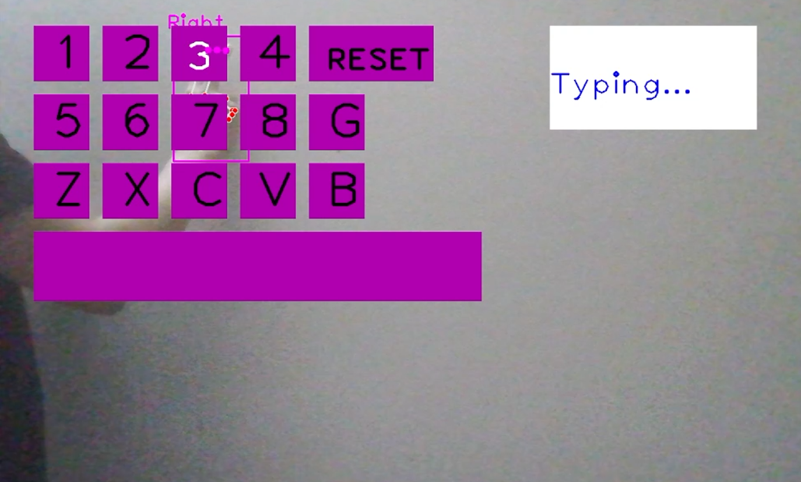

# Virtual_Keyboard

- Simulate virtual button presses to check if the user presses in the correct order.
## Installation:
- requirements.txt


## Run:
- main.py
``` shell
## How it works:
- Step 1: Draw Virtual Keyboard (cv2).
- Step 2: Check the hand points (mediapipe).
- Step 3: Check the button press action.
	- The distance between 2 fingertips < threshold ==> 1 press.
        - Check if the user enters the given order correctly.
- Step 4: Return results to the screen.
